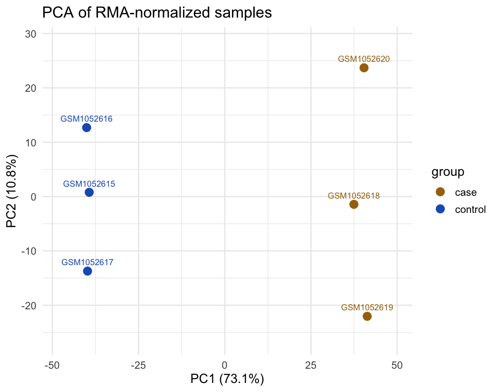
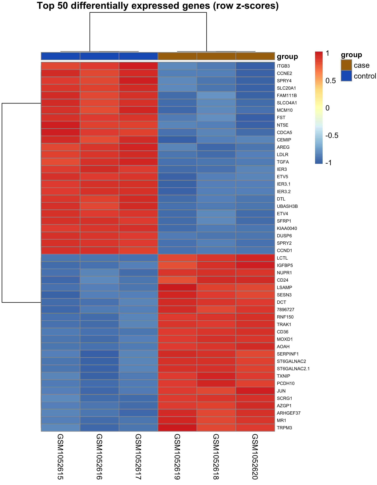

# Microarray Compass

Reproducible microarray differential-expression pipeline: raw Affymetrix CEL
files from GEO → probe-level QC → RMA normalization → limma DE analysis →
clustering → GO/KEGG enrichment, orchestrated with Snakemake.

Ships configured for [GSE42872](https://www.ncbi.nlm.nih.gov/geo/query/acc.cgi?acc=GSE42872)
(vemurafenib vs vehicle in A375 melanoma, 3 vs 3, Human Gene 1.0 ST) and
recovers the expected biology: MAPK feedback genes (*DUSP6*, *SPRY2*) down,
melanocyte differentiation markers (*CD36*, *DCT*) up, enrichment dominated by
cell-cycle shutdown. Any two-group Affymetrix series works via
[config/config.yaml](config/config.yaml).

## Quickstart

```bash
Rscript scripts/install_deps.R          # R >= 4.5, Bioconductor packages
pip install snakemake
snakemake --cores 4                     # downloads data from GEO, runs all stages
```

Or skip the R setup entirely and let Snakemake provision the pinned
environment in [workflow/envs/r-microarray.yaml](workflow/envs/r-microarray.yaml):

```bash
snakemake --cores 4 --use-conda
```

Outputs land in `results/`: QC plots (NUSE/RLE), the expression matrix,
annotated DE tables, volcano/PCA/heatmap/dendrogram figures (plus the sample
tree in Newick), and enrichment tables with dotplots. Per-rule logs go to
`logs/`.

A full run on 6 arrays takes about 90 seconds on an M-series laptop and
yields 1,305 differentially expressed probes (701 up, 604 down at
|log2FC| ≥ 1, FDR ≤ 0.05), 366 enriched GO BP terms, and 13 KEGG pathways
led by cell cycle (hsa04110) and DNA replication (hsa03030).

| PCA | Volcano | Top DEGs |
|---|---|---|
|  |  |  |

Methods, rationale, and how to point it at another dataset:
[docs/pipeline.md](docs/pipeline.md).
