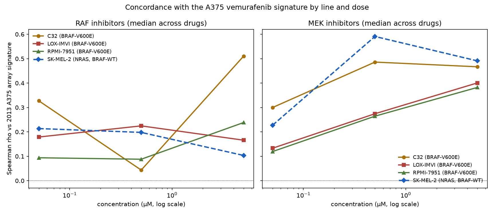
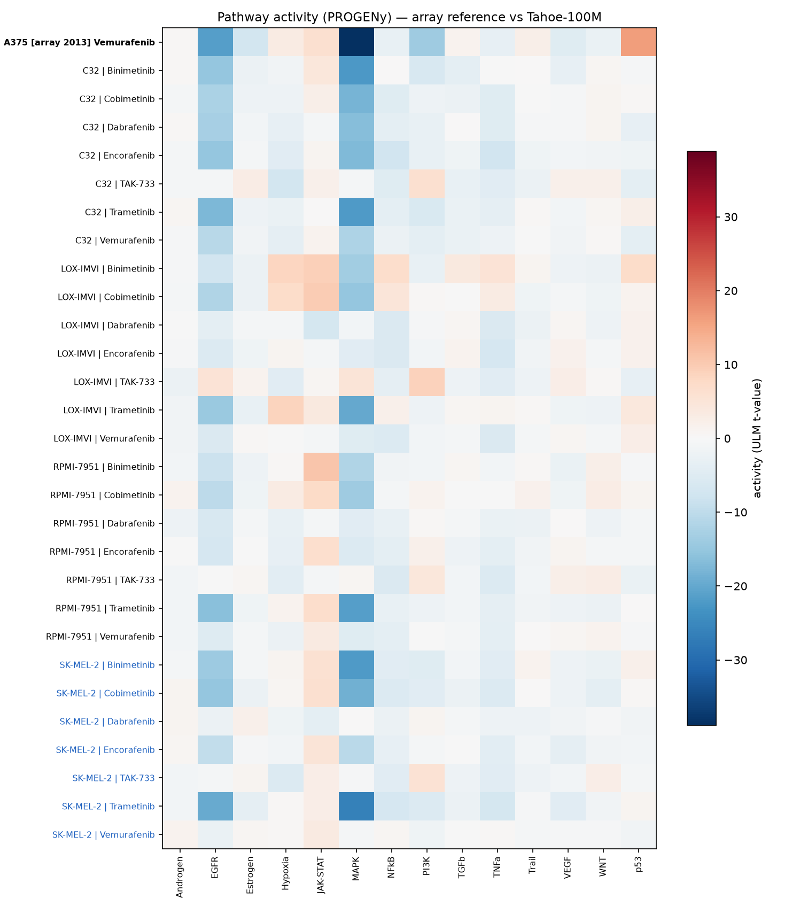
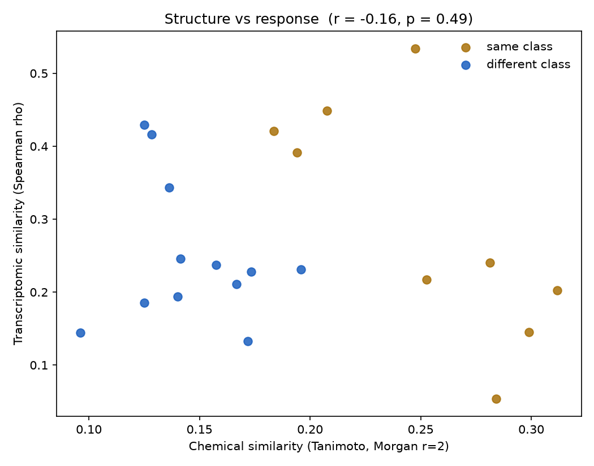
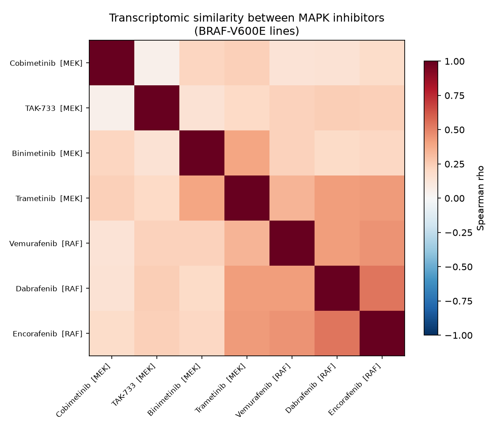
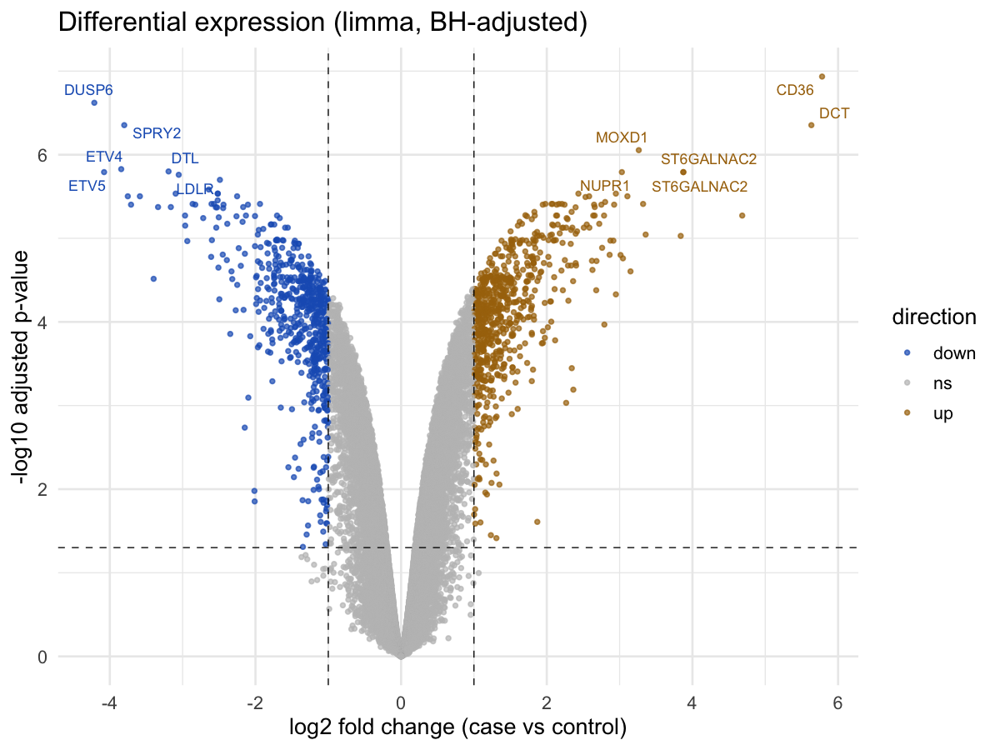

# Results

All figures regenerate from `snakemake --cores 4`; tables are the committed
outputs under `results/comparison/`.

## The signature replicates, dose-dependently, and only on target

At matched (highest) dose, concordance with the 2013 A375 array signature is
`rho = 0.300` across the three BRAF-V600E lines but `0.104` in the NRAS control.
Pooling doses hides this — a sub-effective concentration produces no signature in
any genotype — so the dose-resolved view is the real result.

Vemurafenib, Spearman rho vs the array reference:

| Line | Genotype | 0.05 µM | 0.5 µM | 5 µM |
|---|---|---|---|---|
| C32 | BRAF-V600E | +0.005 | +0.287 | **+0.421** |
| LOX-IMVI | BRAF-V600E | +0.179 | +0.225 | **+0.334** |
| RPMI-7951 | BRAF-V600E | +0.094 | +0.063 | **+0.237** |
| SK-MEL-2 | NRAS, BRAF-WT | +0.214 | +0.356 | **+0.104** |

Concordance climbs monotonically with dose in every BRAF-mutant line and *falls*
at top dose in the NRAS control. Significance is assessed against an empirical
null of 2000 size-matched random gene sets (`p_empirical` in
`signature_concordance.tsv`).

## Pathway activity recovers the pharmacology

Scoring both platforms on the same PROGENy footprints puts a 2013 array and 2025
single-cell data on one axis. MEK inhibitors act downstream of RAS and suppress
MAPK in both genotypes; RAF inhibitors only in the mutant lines.

| Drug class | BRAF-V600E | BRAF-WT (NRAS) |
|---|---|---|
| MEK inhibitor | −14.40 (n=12) | −20.39 (n=4) |
| RAF inhibitor | −4.77 (n=9) | **−0.79** (n=3) |

The array reference itself scores −38.90. That the MEK arm works in SK-MEL-2 is
what licenses the conclusion that the RAF arm's failure there is target
dependency rather than an insensitive assay.

## Chemical structure does not predict transcriptional response

Across the seven inhibitors, within-class transcriptomic similarity (0.241) is
indistinguishable from between-class (0.230), and Tanimoto similarity over Morgan
fingerprints is uncorrelated with response similarity (r = −0.16, p = 0.49).
Structurally unrelated molecules converging on one pathway produce the same
downstream signature — pathway position dominates chemistry.

This is a negative result, and consistent with published findings that
perturbation-prediction models struggle to beat simple baselines.

Clustering the drugs by transcriptomic profile does not recover the RAF/MEK
split either:

## Transcription-factor activity does not discriminate

TF activity is computed and saved (`tf_activity.tsv`) but does **not** reproduce
PROGENy's genotype specificity: ETV4, a direct ERK-driven factor and a top hit in
the array reference, is suppressed about equally regardless of genotype (−2.64 in
BRAF-V600E vs −2.06 in NRAS under RAF inhibition). See the method-choice note in
[pipeline.md](pipeline.md#a-note-on-the-tf-activity-result).

## Reference arm

The microarray arm reproduces exactly across runs: 33,297 probes tested, 701 up
and 604 down at |log2FC| ≥ 1 and FDR ≤ 0.05, PC1 explaining 73.1% of variance and
separating treated from control, and a Newick sample tree that recovers the two
groups as clean clades. The top hits are the expected MAPK feedback genes —
DUSP6, SPRY2, ETV4 and ETV5 down, melanocyte markers CD36 and DCT up:

