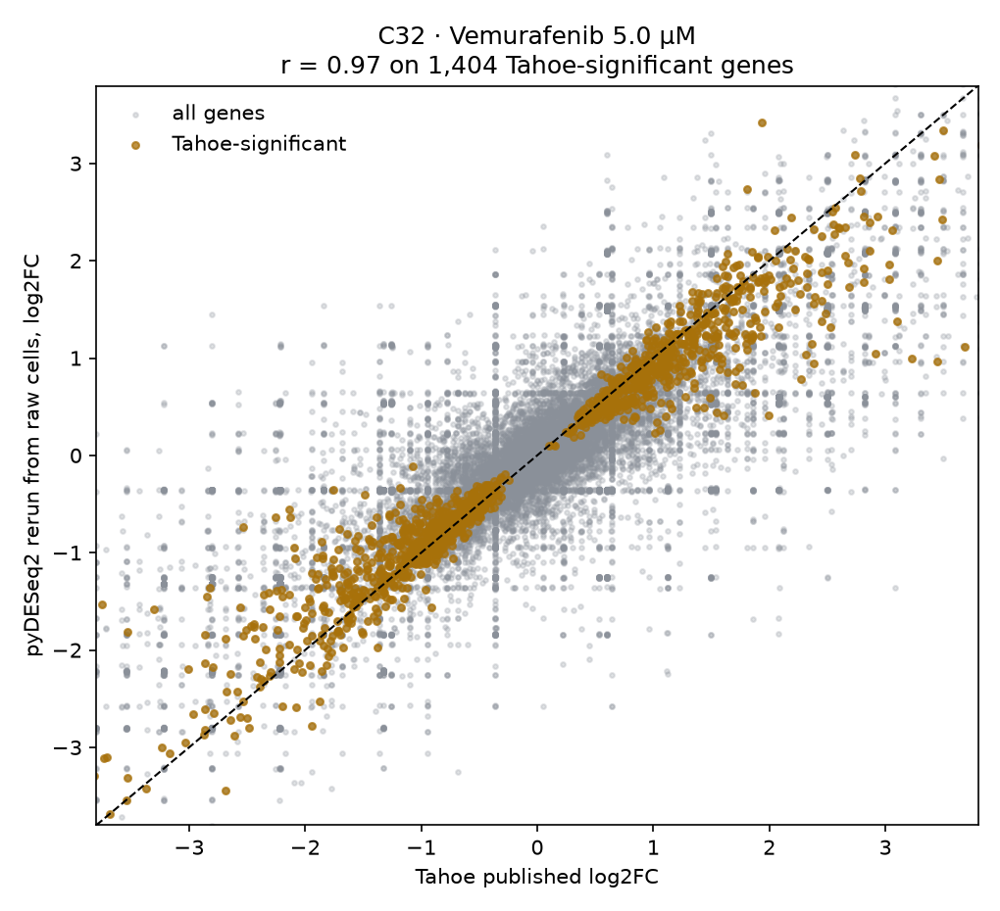

# Results

All figures regenerate from `snakemake --cores 4 --scheduler greedy`. The tables
behind them are committed under [tables/](tables), copied from `results/` of the
run that produced these figures, and `pytest -q tests` checks the headline numbers
against them.

| Table | Source script |
|---|---|
| [signature_concordance.tsv](tables/signature_concordance.tsv) | `tahoe/12` |
| [drug_similarity.tsv](tables/drug_similarity.tsv) | `tahoe/13` |
| [pathway_activity.tsv](tables/pathway_activity.tsv), [tf_activity.tsv](tables/tf_activity.tsv) | `tahoe/14` |
| [deseq2_concordance_summary.tsv](tables/deseq2_concordance_summary.tsv) | `tahoe/16` |

## The signature replicates in most BRAF-V600E contrasts, and in one NRAS contrast

At the highest Tahoe dose (5 µM, GSE42872 used 10 µM), each RAF inhibitor scores
as follows against the 2013 A375 array signature. `p_emp` is the empirical p from
2000 random gene sets of the same size (two-sided, floor 0.0005). The MAPK column
is PROGENy pathway activity for the same contrast.

| Line | Genotype | Drug | Spearman rho | p_emp | PROGENy MAPK |
|---|---|---|---|---|---|
| C32 | BRAF-V600E | Dabrafenib | +0.531 | 0.0005 | −16.43 |
| C32 | BRAF-V600E | Encorafenib | +0.510 | 0.0005 | −17.05 |
| C32 | BRAF-V600E | Vemurafenib | +0.421 | 0.0005 | −12.09 |
| LOX-IMVI | BRAF-V600E | Dabrafenib | +0.107 | 0.156 | −0.96 |
| LOX-IMVI | BRAF-V600E | Encorafenib | +0.166 | 0.020 | −4.35 |
| LOX-IMVI | BRAF-V600E | Vemurafenib | +0.334 | 0.0005 | −4.77 |
| RPMI-7951 | BRAF-V600E | Dabrafenib | +0.238 | 0.002 | −4.40 |
| RPMI-7951 | BRAF-V600E | Encorafenib | +0.300 | 0.0005 | −5.18 |
| RPMI-7951 | BRAF-V600E | Vemurafenib | +0.237 | 0.002 | −4.74 |
| SK-MEL-2 | NRAS, BRAF-WT | Dabrafenib | +0.061 | 0.407 | +0.25 |
| SK-MEL-2 | NRAS, BRAF-WT | Encorafenib | **+0.443** | 0.0005 | **−10.40** |
| SK-MEL-2 | NRAS, BRAF-WT | Vemurafenib | +0.104 | 0.154 | −0.79 |

The medians are `rho = 0.300` (n = 9) in the BRAF-V600E lines and `0.104`
(n = 3) in the NRAS control. Eight of the nine mutant contrasts beat the
random-gene-set null at p_emp ≤ 0.02, and LOX-IMVI dabrafenib does not. In
SK-MEL-2, vemurafenib and dabrafenib show no signature, as designed. Encorafenib
does, with the third-highest rho in the table and MAPK suppression stronger than
any RAF contrast outside C32. The difference in medians is not significant
(one-sided Mann-Whitney p = 0.14), and three control contrasts give the test
little power.

The honest summary is that two of three RAF inhibitors lose the signature in the
NRAS line. The committed tables do not explain the encorafenib result. SK-MEL-2
has encorafenib only at 5 µM in the fetched subset, so there is no dose series
to check it against.

## Dose response is not monotonic

Vemurafenib, Spearman rho vs the array reference.

| Line | Genotype | 0.05 µM | 0.5 µM | 5 µM |
|---|---|---|---|---|
| C32 | BRAF-V600E | +0.005 | +0.287 | **+0.421** |
| LOX-IMVI | BRAF-V600E | +0.179 | +0.225 | **+0.334** |
| RPMI-7951 | BRAF-V600E | +0.094 | +0.063 | **+0.237** |
| SK-MEL-2 | NRAS, BRAF-WT | +0.214 | +0.356 | **+0.104** |

Under vemurafenib, C32 and LOX-IMVI rise with dose, RPMI-7951 dips at 0.5 µM
before rising, and SK-MEL-2 peaks at 0.5 µM and falls at 5 µM. Pooled over the
three RAF inhibitors, as in the figure, the pattern is weaker still. C32 drops to
0.044 at 0.5 µM, and LOX-IMVI falls at 5 µM as SK-MEL-2 does. A low dose does
not reliably mean no signature either. C32 dabrafenib and encorafenib at
0.05 µM give rho 0.341 and 0.327 (p_emp 0.0005).

Two things in the Tahoe subset weaken the dose series. The encorafenib 0.5 µM
contrasts in the three BRAF lines rest on very few treated cells, and no minimum
cell count is applied. Some 0.05 µM RAF contrasts for SK-MEL-2 and LOX-IMVI are
missing, because the shard mapper drops the run-boundary shards that hold them
(see [pipeline.md](pipeline.md#limitations)).

## Pathway activity separates MEK from RAF inhibitors, with one exception

Scoring both platforms on the same PROGENy footprints puts a 2013 array and 2025
single-cell data on one axis. MEK inhibitors act downstream of RAS and suppress
MAPK in both genotypes. RAF inhibitors suppress it in the mutant lines, and in
the NRAS line only under encorafenib.

| Drug class | BRAF-V600E | BRAF-WT (NRAS) |
|---|---|---|
| MEK inhibitor | −14.40 (n=12) | −20.39 (n=4) |
| RAF inhibitor | −4.77 (n=9) | −0.79 (n=3) |

The array reference itself scores −38.90. The NRAS RAF median hides the spread
underneath it (+0.25, −0.79 and −10.40, per the table above). TAK-733 shows no
MAPK suppression in any line (−0.65, +5.01, +0.66 and −0.41 in C32, LOX-IMVI,
RPMI-7951 and SK-MEL-2), so both MEK medians include one inactive compound.

That the other MEK inhibitors work in SK-MEL-2 shows the readout is sensitive
there, so the loss of signal under vemurafenib and dabrafenib is not an assay
failure. It does not account for encorafenib.

## Chemical similarity was not shown to predict transcriptional response

Across the seven inhibitors, within-class transcriptomic similarity (0.241) is
close to between-class (0.230), and Tanimoto similarity over Morgan fingerprints
is uncorrelated with response similarity (r = −0.16, p = 0.49).

This null is fragile. The three RAF inhibitors correlate with each other at 0.42
to 0.53, above 11 of the 12 cross-class pairs. TAK-733, inactive as noted above,
correlates weakly with every other drug (0.05 to 0.25) and pulls the within-MEK
values down. Seven drugs in two uneven classes is a small set, and the result says chemical similarity did not
predict response here, not that pathway position dominates chemistry.

Trametinib sits closer to the RAF inhibitors than to the other MEK inhibitors,
so clustering the drugs by transcriptomic profile does not give a clean RAF/MEK
split.

## Transcription-factor activity does not discriminate

TF activity is computed and saved ([tf_activity.tsv](tables/tf_activity.tsv)) but
does **not** reproduce PROGENy's genotype pattern. ETV4, a direct ERK-driven
factor and a top hit in the array reference, is suppressed about equally
regardless of genotype (median −2.64 in BRAF-V600E vs −2.06 in NRAS under RAF
inhibition). See the method-choice note in
[pipeline.md](pipeline.md#a-note-on-the-tf-activity-result).

## Tahoe's published statistics reproduce

Every Tahoe number in this project comes from their precomputed pseudobulk table.
One contrast, C32 + vemurafenib 5 µM, was rebuilt from the raw expression matrix
(147 plate-3 shards, about 15 GB streamed) and re-tested with pyDESeq2.

The cell extraction lands on Tahoe's own counts. It finds **1,407 control cells,
exactly matching** their reported `n_cells_ctrl`, and 1,448 treated against
their 1,462 (within 1%).

| Gene set | n | Pearson r | Spearman rho | Sign agreement |
|---|---|---|---|---|
| All comparable genes | 24,586 | 0.814 | 0.820 | 84.6% |
| Tahoe-significant | 1,404 | **0.968** | **0.970** | **100.0%** |

On the genes Tahoe calls significant, an independent rerun from raw cells
recovers their fold changes at r = 0.968 and agrees on the direction of every
one. The weaker all-genes figure is expected. Most of the transcriptome is noise
near zero, where the pseudo-replicate split and shrinkage differences scatter
freely, visible as the grey cloud below.

Only this contrast is verified, since each additional one costs another plate
scan.

## Reference arm

The microarray arm reproduces exactly across runs. It tests 33,297 probes and
finds 701 up and 604 down at |log2FC| ≥ 1 and FDR ≤ 0.05. PC1 explains 73.1% of
variance and separates treated from control, and a Newick sample tree recovers
the two groups as clean clades. The top hits are the expected MAPK feedback
genes, with DUSP6, SPRY2, ETV4 and ETV5 down and the melanocyte markers CD36 and
DCT up.

